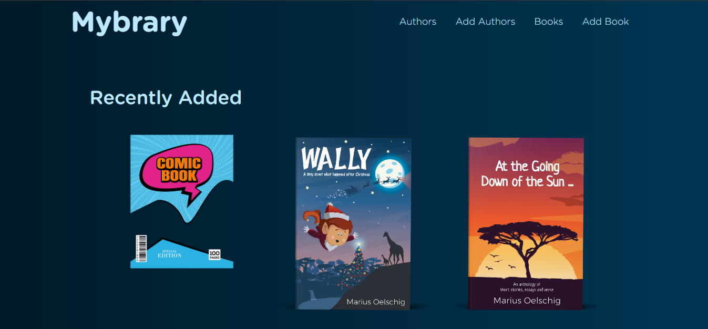
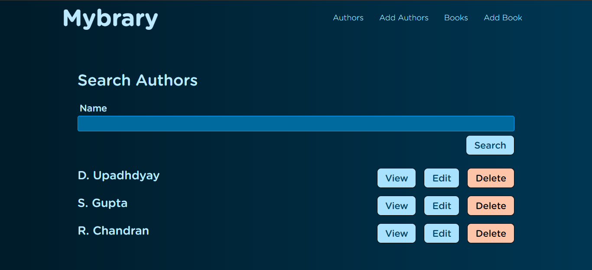
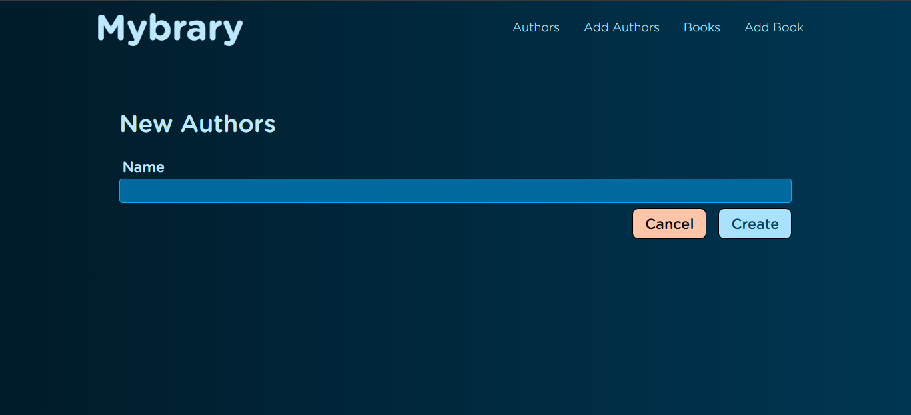
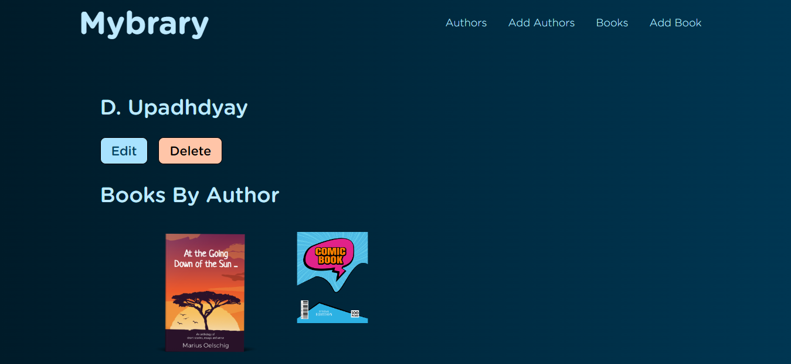
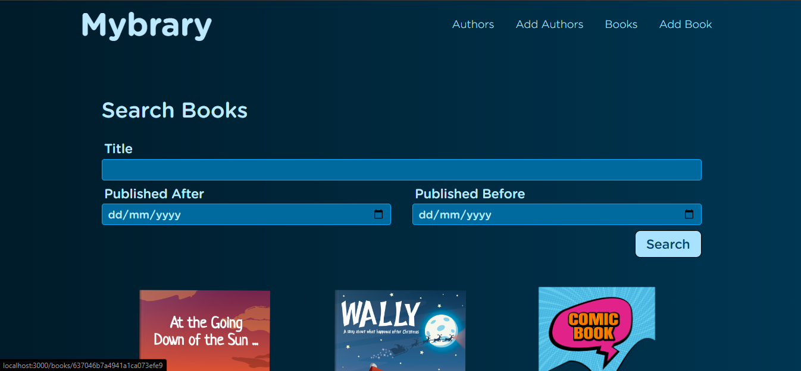
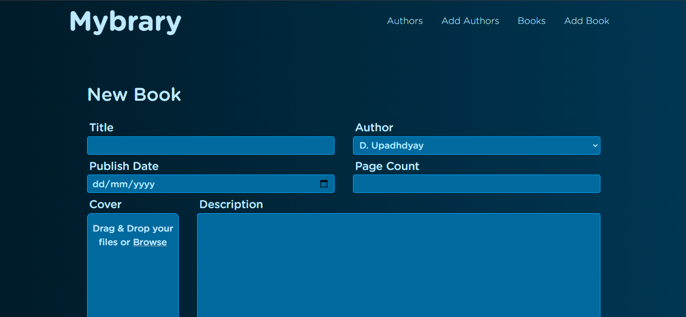
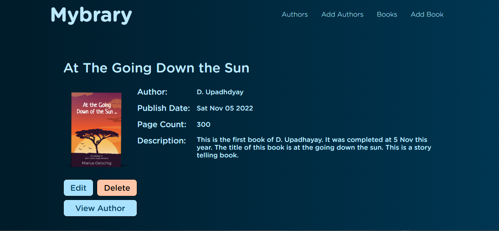

# Mybrary

# Project Done By:  <a href="https://github.com/Manishkumar62" noreferrer target="_blank">Manishkumar</a>

# A small project for adding author and there books

## Github Repository

https://github.com/Manishkumar62/MYBRARY

## Tech Stack

- MongoDB
- Express.js
- Node.js
- Mongoose
- EJS

## What Am I Using and Why ?

```
BACKEND:
  - dotenv                      Storing sensitive information
  - express                     Backend server
  - mongoose                    MongoDB ODM
FRONTEND:
  - ejs                         lets us embed JavaScript code in a template language that is then used to generate HTML
```

## Introduction to Techs

Mybrary is a small application built on the MongoDB, Express, Node, EJS. MongoDB was chosen as the Database Management System (DBMS). 

Mongoose will be used with our MongoDB implementation, it is an Object Data Modelling (ODM) library for use with MongoDB and Node.js. It assists in managing the relationships between data, provides schema validation and is used to translate between objects in Node.js code and the representation of those objects in MongoDB.

## Wireframes









## Steps to setup

- Download the folder
- Open terminal and run {npm init}
- make file as .env and write {DATABASE_URL = {user database url}}
- then run {npm run devStart}
- Open browser at localhost:3000 and Enjoy

#### Thankyou...
